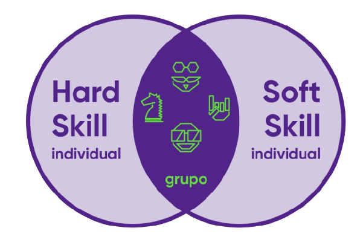

<h1 align="center">
    
</h1>

### Conteúdos
<h2 align="center">
    

[Hard Skill](https://github.com/BrunoNishimura/Gama-Experience-Hacker) | [Soft Skil](https://docs.google.com/document/d/1LahbO0emCWAtnGTXz8aAhKYP594Fsi5imgjzH-_kyl8/edit?usp=sharing) 

</h2>

### <h2 align="center"> Grupos
- [Acredita$](https://github.com/GrowthOn/acreditas)
- [EnsinaCast](https://github.com/EnsinaCast/Educacional)
    </h2>